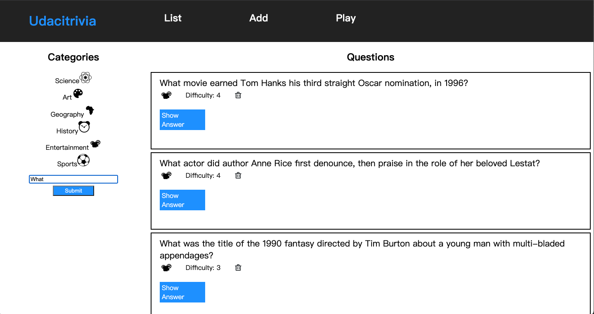
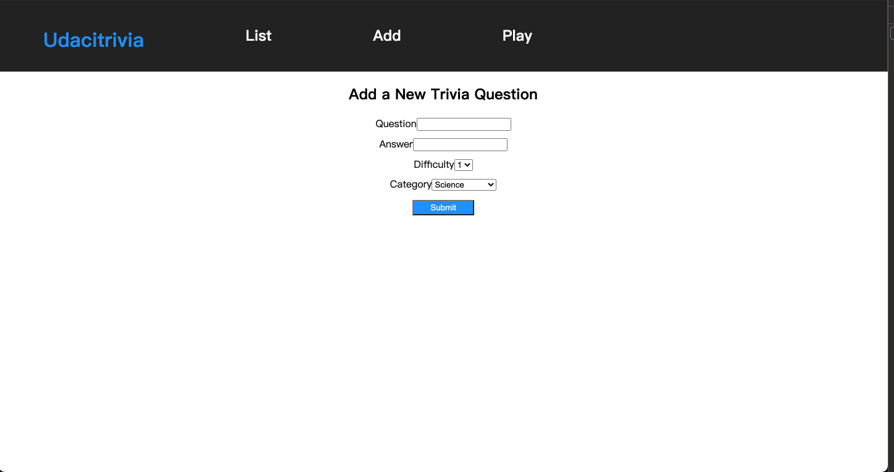
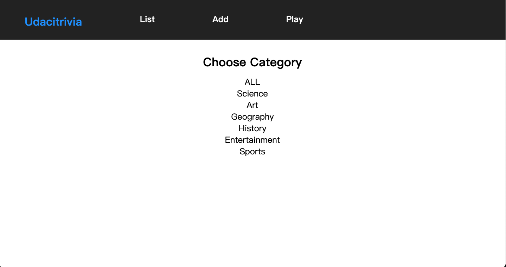

# udacity_02_trivia_api

## Introduction
- a guessing game playground

## Features:

## List
- list all of the questions and answers



## Add
- add a new question


## Play
- select a category and start quiz mode


# Endpoints

## errors
- **404** error: question or category not found
    ```
    {
        'success': False,
        'message': 'Not Found'
    }
    ```
- **422** error: unprocessable request data, e.g. the question want to delete is no longer exist
    ```
    {
        'success': False,
        'message': 'Not Found'
    }
    ```

## Resource Endpoint
### GET /categories
- Fetches a dictionary of categories in which the keys are the ids and the value is the corresponding string of the category
- Request Arguments: None
- Returns: An object with a single key, categories, that contains an object of id: category_string key:value pairs. 
    ```
    {
        'success': True,
        'categories': { '1' : "Science",
        '2' : "Art",
        '3' : "Geography",
        '4' : "History",
        '5' : "Entertainment",
        '6' : "Sports" }
    }
    ```

### GET /questions?page=${integer}
- Fetches a paginated set of questions, a total number of questions, all categories and current category string. 
- Request Arguments: page - integer
- Returns: An object with 10 paginated questions, total questions, object including all categories, and current category id
    ```
    {
        'success': True,
        'questions': [
            {
                'id': 1,
                'question': 'This is a question',
                'answer': 'This is an answer', 
                'difficulty': 5,
                'category': 2
            },
        ],
        'total_questions': 100,
        'categories': { '1' : "Science",
        '2' : "Art",
        '3' : "Geography",
        '4' : "History",
        '5' : "Entertainment",
        '6' : "Sports" },
        'current_category': 3
    }
    ```

### GET /categories/${category_id}/questions?page={integer}
- Fetches questions for a cateogry specified by id request argument 
- Request Arguments: category_id - integer, page - integer
- Returns: An object with questions for the specified category, total questions, and current category id 
    ```
    {
        'success': True,
        'questions': [
            {
                'id': 1,
                'question': 'This is a question',
                'answer': 'This is an answer', 
                'difficulty': 5,
                'category': 4
            },
        ],
        'total_questions': 100,
        'current_category': 3
    }
    ```

### DELETE /questions/${question_id}
- Deletes a specified question using the id of the question
- Request Arguments: question_id - integer
- Returns: Does not need to return anything besides the appropriate HTTP status code. Optionally can return the id of the question. If you are able to modify the frontend, you can have it remove the question using the id instead of refetching the questions. 
    ```
    {
        'success': True,
        'message': 'Question Deleted'
    }
    ```
### POST /play/quizzes
- Sends a post request in order to get the next question 
- Request Body: 
    ```
    {
        'previous_questions':  an array of question id's such as [1, 4, 20, 15]
        'quiz_category': {'type': category_name, 'id': category_id}
    }
    ```
- Returns: a single new question object 
    ```
    {
        'success': True,
        'question': {
            'id': 1,
            'question': 'This is a question',
            'answer': 'This is an answer', 
            'difficulty': 5,
            'category': 4
        }
    }
    ```

### POST /add/questions
- Sends a post request in order to add a new question
- Request Body: 
    ```
    {
        'question':  'Heres a new question string',
        'answer':  'Heres a new answer string',
        'difficulty': 1,
        'category': 3,
    }
    ```
- Returns: inform question added
    ```
    {
        'success': True,
        'message': 'Question Added'
    }
    ```
### POST /questions
- Sends a post request in order to search for a specific question by search term 
- Request Body:
    ``` 
    {
        'searchTerm': 'this is the term the user is looking for'
    }
    ```
- Returns: any array of questions, a number of total questions that met the search term and the current category id 
    ```
    {
        'questions': [
            {
                'id': 1,
                'question': 'This is a question',
                'answer': 'This is an answer', 
                'difficulty': 5,
                'category': 5
            },
        ],
        'total_questions': 100,
        'current_category': 5
    }
    ```